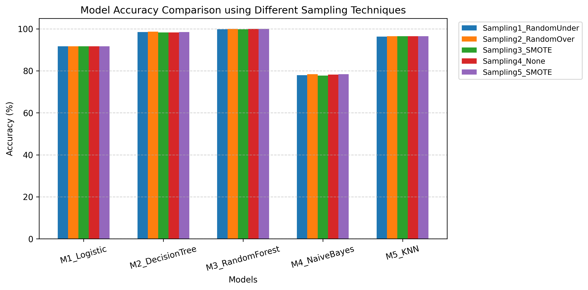

# 📊 Sampling Assignment – Credit Card Dataset

## 📌 Overview
This project demonstrates the importance of **sampling techniques** for handling **imbalanced datasets** in machine learning.  
A highly imbalanced credit card dataset is balanced using different sampling methods, and multiple ML models are evaluated to analyze the impact on accuracy.

---

## 📂 Dataset
- **Dataset Name:** Credit Card Data  
- **Target Column:** `Class`
  - `0` → Non-Fraud
  - `1` → Fraud
- The dataset is highly imbalanced, with very few fraud cases.

---

## ⚙️ Methodology

### 1️⃣ Data Preprocessing
- Dataset loaded using **Pandas**
- Features and target separated
- Feature scaling applied using **StandardScaler**

### 2️⃣ Handling Class Imbalance
- Dataset was initially balanced using **Random Oversampling**
- This ensures equal representation of both classes before applying further sampling techniques

### 3️⃣ Sampling Techniques Applied

| Sampling Code | Technique |
|:-------------:|:----------|
| **Sampling1** | Random Undersampling |
| **Sampling2** | Random Oversampling |
| **Sampling3** | SMOTE |
| **Sampling4** | No Sampling |
| **Sampling5** | SMOTE (different random state) |

> 💡 **Note:** SMOTE is used twice to check the consistency of results with different random states.

### 4️⃣ Machine Learning Models Used

| Model Code | Algorithm |
|:----------:|:----------|
| **M1** | Logistic Regression |
| **M2** | Decision Tree |
| **M3** | Random Forest |
| **M4** | Naive Bayes |
| **M5** | K-Nearest Neighbors (KNN) |

Each model is trained using all five sampling techniques and evaluated using **accuracy score**.

---

## 📈 Results

### 🔹 Accuracy Comparison Table

| Model | Sampling1 | Sampling2 | Sampling3 | Sampling4 | Sampling5 |
|:------|:---------:|:---------:|:---------:|:---------:|:---------:|
| **M1_Logistic** | 91.70 | 91.70 | 91.70 | 91.70 | 91.70 |
| **M2_DecisionTree** | 98.47 | 98.25 | 98.25 | 98.47 | 98.47 |
| **M3_RandomForest** | 99.78 | 99.56 | 100.00 | 99.78 | 100.00 |
| **M4_NaiveBayes** | 77.95 | 78.38 | 77.73 | 78.17 | 78.38 |
| **M5_KNN** | 96.29 | 96.51 | 96.51 | 96.51 | 96.51 |

---

## 📊 Accuracy Comparison Graph

---

## 🏆 Key Observations

✅ **Random Forest (M3)** achieved the highest accuracy (up to 100%)  
✅ **SMOTE** provided the most consistent improvement across models  
✅ Logistic Regression remained stable across all sampling techniques  
✅ Naive Bayes showed sensitivity to sampling methods

---

## ✅ Conclusion

Sampling techniques play a crucial role in improving model performance on imbalanced datasets.  

Among all techniques, **SMOTE combined with ensemble models like Random Forest** produced the best results.  

This study highlights the importance of selecting appropriate sampling strategies for real-world fraud detection problems.

---

## 🛠 Technologies Used

**Libraries:**
- Python
- Pandas, NumPy
- Scikit-learn
- Imbalanced-learn
- Matplotlib

---

## 👩‍💻 Author

**Himani Mahajan**  
Computer Engineering Student  
Sampling Assignment – Machine Learning

---

### ⭐ If you found this project helpful, please consider giving it a star!

